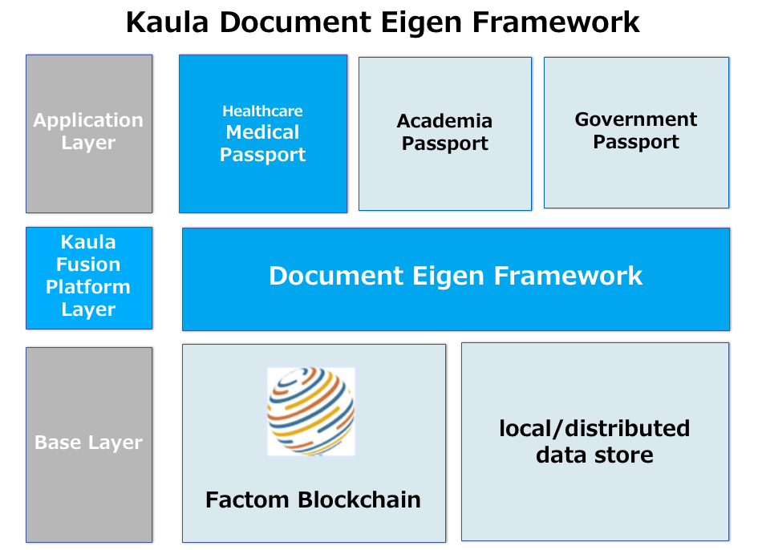

# Document Eigen Framework

## Background:

Kaula have been developing and introducing Factom and its unique autonomous blockchain for record managemen of any documents and data. Factom is so powerful and easy to use to build applications and to add blockchain capability to existing applications. Kaula applied Factom to access record management of  Japanese Security number system in local govenments.

Through this business Kaula has been noticed that we need some secured private data store of such as healthcare, academia, etc. It should be self-sovereign, managed by himself (herself) but not by any third parties, could be modified (corrected) and deleted (forgotten if case data were not longer required).
The above capability is so widely needed. We call it "Passports" and its embodyment is Medical Passport (for healthcare segment), Academia Passport, Govenment Passport and so on.

## Kaula's "Document Eigen Framework" (EDF)

Kaula develops "Document Eigen Framework" to easily build such Passports. Plese see the figure below.
Any access footprints, including creat, update and erase, are kept in Blockchain ( such as Factom) and it is anti-tamperd, transparent and auditable. The private data themselves are stored in any place accoring to user requirements, sometimes in local store, sometimes in public store with encryption. Passport ID is given to the personal, and SSO is coordinated.
It is self-sovereign, poratble, completely managed by the personal, and GDPR-compliant.
It addition, EDF supports "Trustee model" as well.

For more detailed infomation, please contact us.

## Changes
Digital Passport is not dependent on Factom now.
